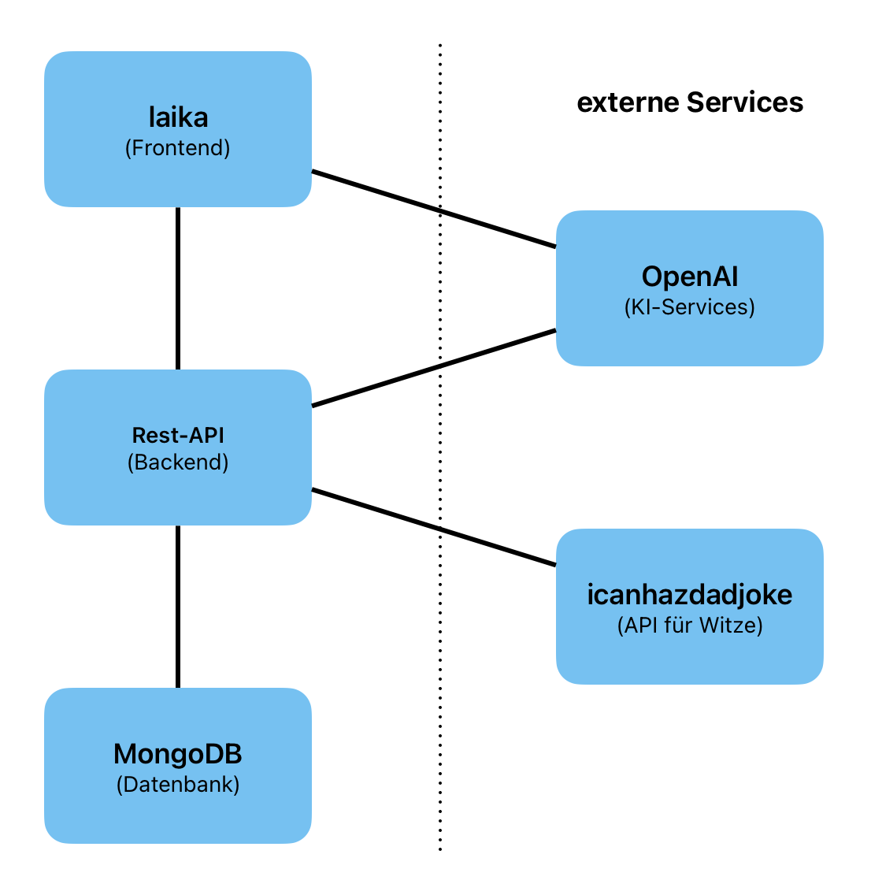

# laika - live ai for konversational assistance

## Inhaltsverzeichnis

- [Einleitung](#einleitung)
- [Architektur](#architektur)

## Einleitung

laika ist eine interaktive Anwendung zur Erstellung von Gruppenchats mit beliebig vielen Mitgliedern.

Die Gruppenchats werden von dem KI-Modell llama-guard-3-1b moderiert, um die Nutzer vor beleidigenden, anzüglichen oder offensiven Inhalten zu schützen.
Zudem ist das KI-Modell llama-3.3-70b über Commands innerhalb von Chat-Nachrichten, wie z. B. "!laika", direkt ansprechbar, was zur Verbesserung der Gesprächsqualität und Unterhaltung der Nutzer beitragen kann.

Zuletzt ist auch die externe API icanhazdadjoke über Commands ansprechbar und es kann auch durch einen Prompt nach bestimmten Witzen gesucht werden.
icanhazdadjoke bietet allerdings nur englischsprachige Witze, weshalb auch das Such-Feature nur mit englischen Prompts zufriedenstellende Ergebnisse liefert.

## Architektur

Wie aus dem Architekturdiagramm hervorgeht, ist die Anwendung nach der gängigen 3-Tier-Architektur aufgebaut und die Komponenten kommunizieren über http/s-Requests mit den externen Services icanhazdadjoke und den von der TH-Lübeck gehosteten OpenAI-KI-Modellen.

Das Frontend wurde mithilfe von NiceGui realisiert und bekommt durch http-Requests die benötigten Daten von der Rest-API.
Während des Chattens wird eine Websocket-Verbindung vom Frontend zum Websocket-Server der Rest-API hergestellt, um Nachrichten schnellstmöglich bei anderen Chat-Mitgliedern darstellen zu können.
Vor dem Absenden einer Nachricht prüft das Frontend die Eingabe über das Moderationsmodell llama-guard-3-1b.
Zuletzt wurde das Frontend mit Docker containerisiert und läuft im Kubernetes-Cluster auf 2 Pods.
Hierbei wurde nur die CPU-Request auf 0,125 CPUs erhöht, während den anderen Ressourcen der eingestellte Default-Wert für Pods zugeteilt wurde.

Die Rest-API benutzt das FastAPI-Framework und bietet weitgehend REST-konforme Endpunkte, um dem Frontend eine zentrale Schnittstelle zur Datenbank zur Verfügung zu stellen.
Darüber hinaus bietet die Rest-API auch weitere Funktionen, wie die Vergabe und das Prüfen von JWT-Tokens, um nur authentifizierten Usern Zugang zu den Funktionen zu ermöglichen. 
Zudem prüft die Rest-API auch die gesendeten Messages auf die bereits erwähnten Commands und sendet ggf. http/s-Requests an icanhazdadjoke oder das TTT-Modell llama-3.3-70b.
Auch die Rest-API wurde mit Docker containerisiert und läuft ebenfalls auf 2 Pods mit jeweils denselben Ressourcen wie die Frontend Pods.

Die Datenbank ist eine MongoDB-Datenbank und speichert User, Chats und Messages.
MongoDB ist durch die JSON-Struktur sehr flexibel und hat eine hohe Skalierbarkeit, wodurch sie für ein Chat-Portal gut geeignet ist.
MongoDB sind im Kubernetes Cluster 2 Pods in Form eines Stateful-Sets zugeteilt, wobei die Ressourcen je Pod doppelt so hoch sind wie die Ressourcen der Frontend- und Rest-API-Pods.
Dadurch wird die schnelle Ausführung der DB-Queries sichergestellt.

Zudem habe ich mich auch gegen die Einbindung von TTI- und ITT-Modellen entschieden, da die Verarbeitung und Darstellung von Grafiken im Allgemeinen viele Ressourcen beansprucht, welche ich im Rahmen dieses Projekts leider nicht zur Verfügung hatte.
Außerdem bleibt die Anwendung dadurch leichter verständlich und ist schneller intuitiv erfassbar.
